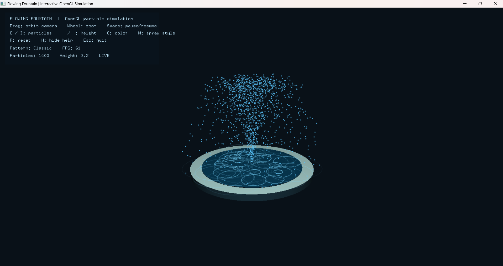

# Flowing Fountain

An interactive 3D fountain simulation in C++ using OpenGL and GLUT. The original project is preserved as a compatibility-profile graphics application; the simulation now uses a bounded particle pool and elapsed-time updates so its motion and controls behave consistently across different frame rates.



## Features

- Water launches from the basin, rises to the selected fountain height, and falls back under gravity.
- Animated particles use randomized trajectories and continuous emission; water impacts trigger expanding pool ripples.
- Orbit and zoom the camera with the mouse.
- Adjust particle density, fountain height, and focused/classic/wide spray patterns while the simulation runs.
- Pause, resume, reset, and cycle water colors.
- On-screen controls, current simulation settings, and frame-rate display.
- CMake build for reproducible setup on Windows, Linux, and macOS.

## Controls

| Input | Action |
| --- | --- |
| Drag with left mouse button | Orbit the camera |
| Mouse wheel | Zoom in or out |
| `Space` | Pause or resume |
| `[` / `]` | Decrease or increase particle count |
| `-` / `+` | Lower or raise the fountain |
| `C` | Cycle water color |
| `M` | Cycle focused, classic, and wide spray patterns |
| `R` | Reset the simulation |
| `H` | Show or hide the help panel |
| `Esc` | Quit |

Particle count is limited to 200–6,000 to keep the simulation responsive. The random seed is fixed for repeatable demo behavior.

## Build on Windows with MSYS2

Install MSYS2, open the **MSYS2 UCRT64** terminal, and install the compiler and graphics dependencies:

```bash
pacman -S --needed mingw-w64-ucrt-x86_64-gcc mingw-w64-ucrt-x86_64-cmake mingw-w64-ucrt-x86_64-ninja mingw-w64-ucrt-x86_64-freeglut
```

Then build and run from the project directory (replace the Windows username if needed):

```bash
cd /c/Users/gouth/Desktop/projects/flowing-fountain-cg
cmake -S . -B build -G Ninja
cmake --build build
./build/fountain.exe
```

## Build on Ubuntu or Debian

```bash
sudo apt update
sudo apt install build-essential cmake freeglut3-dev libglu1-mesa-dev libgl1-mesa-dev
cmake -S . -B build
cmake --build build
./build/fountain
```

## Build on macOS

Install Homebrew dependencies, then configure and build:

```bash
brew install cmake freeglut
cmake -S . -B build
cmake --build build
./build/fountain
```

## Project files

- `main.cpp` — simulation, rendering, camera, and input handling.
- `CMakeLists.txt` — portable build configuration.
- `flowing fountain.cbp` — original Code::Blocks project file, retained for users of the original IDE.
- `CG mini prjct.txt` — original project notes.

## Technical notes

The animation advances from elapsed time rather than changing particle positions during rendering. The update step is capped after long pauses to avoid unstable jumps. Particle storage is resized when its setting changes, camera input is handled independently from the render loop, and water impacts create short-lived expanding ripples. The jet is represented by the particle stream itself rather than a static line.

This project uses sample graphics and a fixed-function OpenGL pipeline to retain compatibility with the original coursework. It is a real-time visual simulation, not a physically calibrated fluid model.
